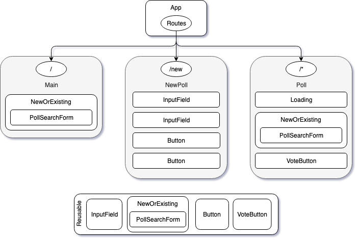

# Pollster

Pollster is a web app that allows user to create and share simple polls. After creating a poll (/new) the poll is saved with a short ID that is then returned to the user. Navigating to that short id (/`~shortID~`) displays the poll and allows users to vote on the various options, altering the percentages and votes counted in realtime.

## Setup

_Coming to firebase soon_

1. Clone from `https://github.com/ben-kirby/pollster.git`
2. In parent directory, run `$ npm install; npm run start`
3. In your browser, navigate to `localhost:8080`

## Structure

### UI

#### Main

#### New Poll

#### Existing Poll

### Componenet Tree

## Features

- Can navigate to `/new` to create a new poll with unlimited options.
- If the user knows the poll ID beforehand (not implemented into UI yet) they can navigate to `/*Short_ID*` and poll info will diplay.
- Users can vote on polls.
- After creating a poll, users get a link to it along with the poll code.
- If a user goes to a bad URL it will prompt them to either make a new poll or search for another one.
- Polls are searchable by their ID.

## Known Issues

- No way for users to retreive a poll ID once a poll is made.
- No navigation buttons. Users have to know the URL or use back/forward buttons.
- Voting is not live updating. Have to refresh to see changes.
- Users can vote as often as they want.
- Link generated on poll submission doesnt go anywhere.

## What's Next

- [x] Come up with a voting system.
- [x] Get votes to update in the database.
- [x] Add UI/Styling
- [x] Return a poll ID upon creation of a new poll.
- [ ] Better navigation